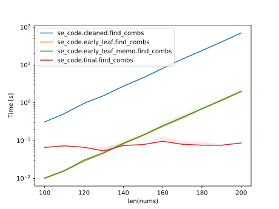
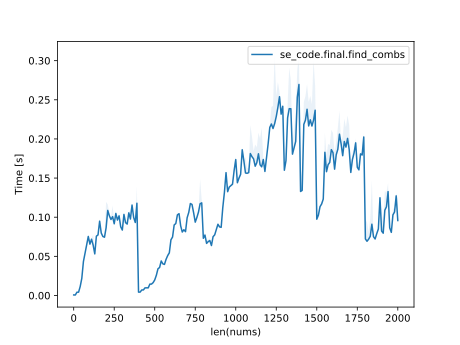

Readability is #1
-----------------

1.  Global variables are bad. Don't use them. I have to spend a long while looking at your code to tell what uses them and when. When your code becomes hundreds of lines long this is tedious and unmaintainable.

    If you need to use recursion and add to something not in the recursive function use a closure.

2. You should load :code:`available` into an object, rather than extract the information from it each and every time you use it.
3. Using the above you can simplify all your :code:`totalNames`, :code:`totalCarbs` into one list.
4. Rather than using :code:`AllSP` and :code:`AllNames` you can add a tuple to one list.
5. You should put all your code into a :code:`main` so that you reduce the amount of variables in the global scope. This goes hand in hand with (1).
6. Rather than copying and pasting the same line multiple times you can create a function.

All this gets the following. Which should be easier for you to increase the performance from:

.. literalinclude:: ../../src/se_code/cleaned/__init__.py
    :language: python

I want speed and I want it now!
-------------------------------

To speed up your program you can return early. Knowing :code:`if sum(total_calories) + food.calories <= MAXCALORIES:` then you should return if the inverse is true when :code:`food` is the food with the lowest amount of calories.

.. code-block::

    def find_combs(available, MAXCALORIES):
        all_combinations = []
        min_calories = min(a.calories for a in available)

        def inner(total):
            if sum(f.calories for f in total) + min_calories > MAXCALORIES:
                sp = find_sp(total)
                if sp is not None:
                    all_combinations.append((sp, total))
            else:
                for food in available:
                    total_calories = [f.calories for f in total]
                    if sum(total_calories) + food.calories <= MAXCALORIES:
                        inner(total[:] + [food])

        inner([])
        return max(all_combinations, key=lambda i: i[0])

| I added another function that performs naive memoization via an LRU cache with an unbound size. However it seemed to slow the process.
| The function that runs in roughly linear time is described below.

How to optimizing the algorithm
-------------------------------

Firstly the equations are:

.. math::

    g(f, a) = \frac{\Sigma(f_{a_i} \times f_{\text{calories}_i})}{\Sigma(f_{\text{calories}_i})}

.. math::

    n = \{g(f, \text{carbs}), g(f, \text{protein}), g(f, \text{fat}), g(f, \text{vitimins})\}

.. math::

    \text{SP} = g(f, \text{nutrients}) \times \frac{\Sigma n}{2\max(n)} + \text{Base gain}

From here we have to find the maximums.

1.  What's the maximum and minimum that :math:`\frac{\Sigma n}{2\max(n)}` can be?

    .. math::

        \frac{n + n + n + n}{2 \times n} = \frac{4n}{2n} = 2

    .. math::

        \frac{n + 0 + 0 + 0}{2 \times n} = \frac{n}{2n} = 0.5

    This means all we need to do is ensure the calorie average of all the different nutrients are the same. It doesn't matter what value this average is, only that all have the same.

2.  What's the maximum that :math:`g(f, \text{nutrients})` can be?

    Firstly taking into account:

    .. math::

        \frac{\Sigma(a_i \times b_i)}{\Sigma(b_i)} = \Sigma(a_i \times \frac{b_i}{\Sigma(b_i)})

    We know that these are the calorie average of the foods nutritional value. To maximize this you just want the foods with the highest nutritional value.

Lets work through an example lets say we have the following five foods:

- a/10/0/0/0/1
- b/0/10/0/0/1
- c/0/0/10/0/1
- d/0/0/0/10/1
- e/1/1/1/1/4

What's the way to maximize SP?

| Eating 1 e would give you :math:`4 \times 2 = 8`.
| Eating 4 a would give you :math:`10 \times 0.5 = 5`.
| Eating 1 a, b, c and d would give you :math:`10 \times 2 = 20`.

And so from here we have deduced eating a, b, c and d in ratios of 1:1:1:1 give the most SP.

This means the rough solution is to find the foods that have the same calorie average for their individual nutrients where you select foods with a bias for ones with high total nutrients.

.. literalinclude:: ../../src/se_code/final/__init__.py
    :language: python

Which runs fairly quickly across the board:

Output is also what you'd expect:

.. testsetup::

    from se_code.final import find_combs, available

.. doctest::

    >>> find_combs(available, 2000)
    (79.65454545454546, (Food(name='Simmered Meat', carbs=6.0, protein=18.0, fat=13.0, vitamins=5.0, calories=900.0), Food(name='Vegetable Medley', carbs=8.0, protein=4.0, fat=7.0, vitamins=17.0, calories=900.0), Food(name='Flour', carbs=15.0, protein=0.0, fat=0.0, vitamins=0.0, calories=50.0), Food(name='Flour', carbs=15.0, protein=0.0, fat=0.0, vitamins=0.0, calories=50.0), Food(name='Flour', carbs=15.0, protein=0.0, fat=0.0, vitamins=0.0, calories=50.0), Food(name='Flour', carbs=15.0, protein=0.0, fat=0.0, vitamins=0.0, calories=50.0)))
