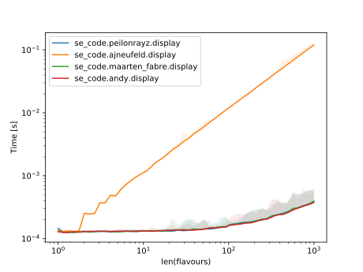
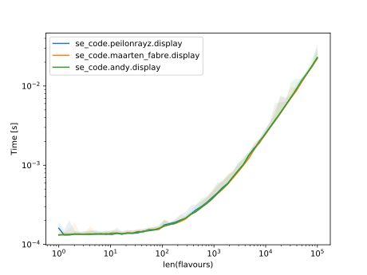

The best solution is to use [`str.join()`](https://docs.python.org/3/library/stdtypes.html#str.join), using `', '` as the joining string.

```
def display(flavours):
    print(', '.join(flavours) + '.')
```

Outputting:

<!-- from se_code.peilonrayz import display -->
```
>>> display(['chocolate', 'vanilla', 'caramel', 'strawberry', 'coffee'])
chocolate, vanilla, caramel, strawberry, coffee.
```

Comparing this to the two adaptions of my approach, and against AJNeufeld in one of the graphs:







**NOTE**: Code to [plot the graphs](https://github.com/Peilonrayz/Stack-Exchange-contributions/blob/master/code-review/226974/tests/test_plot.py), [complete changes](https://github.com/Peilonrayz/Stack-Exchange-contributions/tree/master/code-review/226974).
