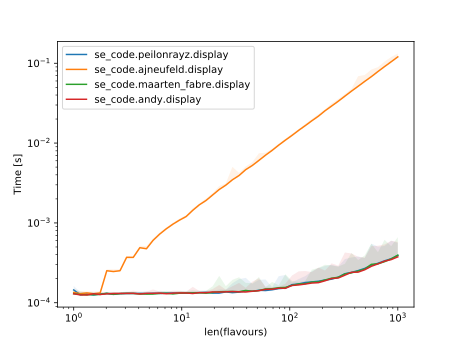
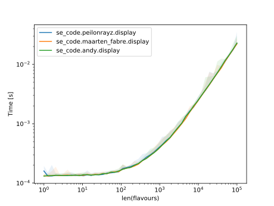

The best solution is to use :meth:`str.join`, using :code:`', '` as the joining string.

.. literalinclude:: ../../src/se_code/peilonrayz/__init__.py
    :language: python

Outputting:

.. testsetup::

    from se_code.peilonrayz import display

.. doctest::

    >>> display(['chocolate', 'vanilla', 'caramel', 'strawberry', 'coffee'])
    chocolate, vanilla, caramel, strawberry, coffee.

Comparing this to the two adaptions of my approach, and against AJNeufeld in one of the graphs:

.. note::

    Code to `plot the graphs <https://github.com/Peilonrayz/Stack-Exchange-contributions/blob/master/code-review/226974/tests/test_plot.py>`_, `complete changes <https://github.com/Peilonrayz/Stack-Exchange-contributions/tree/master/code-review/226974>`_.